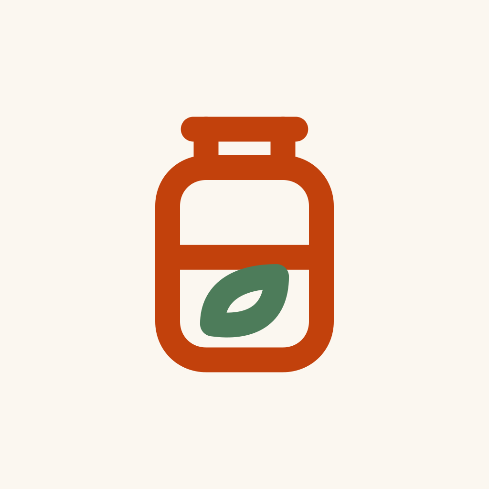

<p align="center">
  
</p>

<h1 align="center">SmartPantry</h1>

<p align="center">
  Snap a grocery receipt → get a digital pantry → get warned before food spoils → cook what's about to expire.
</p>

<p align="center">
  
  
  
  
</p>

> This is a **showcase** repository. The source code is private; this page describes what the
> app does and how it is built.

---

## The problem

Food goes off in the fridge because nobody remembers what's in there or when it was bought.
Typing every item into an app by hand is the reason most pantry apps get abandoned.

SmartPantry removes the typing: one photo of the receipt fills the pantry, every item gets an
expiry date automatically, and the app reminds you before anything spoils — with recipes that
use those items up.

## Features

**Getting food in**
- **Receipt scanning** — photograph a grocery receipt; OCR reads it and an LLM turns
  abbreviated receipt lines (think "ORG BBY SPNCH") into clean pantry items with categories.
  You review and confirm before anything is saved.
- **Barcode scanning** — scan a product's barcode to add it with its brand.
- **Expiry-date scanning** — photograph the printed "best before" date and it overrides the
  estimate for that item.
- **Manual entry** with units (pcs, g, kg, ml, l), brands and custom categories (emoji or icon).

**Keeping track**
- **Automatic expiry dates** from a curated shelf-life table keyed by food and storage
  location — moving spinach from the fridge to the freezer recalculates its date.
- **Daily expiry sweep** — a scheduled server job finds items about to expire and sends
  push notifications.
- **Recipe suggestions** generated only from what's expiring soon, so the suggestion is
  always "use this up", not "go shopping".

**Sharing**
- **Multiple pantries** — each with its own invite code and member list, so a household,
  a flat-share and an office kitchen can each have one.
- **Food and medicine sections** in every pantry, with medicine expiry tracked the same way.
- **English, Arabic (RTL), Spanish and French**, plus light and dark mode.

## How it works

```
        ┌──────────────┐  photo   ┌───────────────────┐
        │  Expo app    │ ───────▶ │ Supabase Storage  │  (private bucket, per-user folders)
        │ (iOS/Android)│          └─────────┬─────────┘
        └──────┬───────┘                    │
               │                  ┌─────────▼──────────┐
               │                  │ Edge Function:      │   Cloud OCR ──▶ LLM normalisation
               │                  │ extract-receipt     │ ──────────────────────────────────┐
               │                  └────────────────────┘                                    │
               │                                                                            ▼
               │◀──────────── pantry items, expiry status ─────────────  Postgres (Row Level Security)
               │                                                          + shelf-life table + triggers
               │                                                                            │
               │                  ┌────────────────────┐   daily (pg_cron)                  │
               │◀── push ──────── │ Edge Function:      │ ◀──────────────────────────────────┤
               │                  │ expiry-sweep        │                                    │
               │                  └────────────────────┘                                    │
               │                  ┌────────────────────┐                                    │
               └── "what can I ──▶│ Edge Function:      │ ── LLM, constrained to expiring ───┘
                    cook?"        │ suggest-recipes     │    items only
                                  └────────────────────┘
```

Three independent subsystems, each testable on its own:

1. **Capture & extraction** — receipt OCR → LLM normalisation → reviewed pantry items
   (plus barcode lookup and printed-date extraction).
2. **Pantry & decay engine** — a shelf-life table and database triggers compute and
   recompute expiry dates; a scheduled sweep raises notifications.
3. **Recipe engine** — an LLM prompt constrained to the user's expiring ingredients.

## Engineering notes

- **Keys never reach the phone.** OCR and LLM calls happen only inside Edge Functions; the app
  holds nothing but the public Supabase URL and anon key.
- **Row Level Security on every user table** — a user (or pantry member) can only ever read
  their own rows, enforced by Postgres rather than by app code.
- **Private storage** — receipt images live in per-user folders behind storage policies.
- **Cost control** — the app is free, so each AI-backed function has a per-user daily cap
  enforced server-side.
- **Abuse protection** — invite codes are throttled against brute-force guessing.
- **Account deletion** removes the user's data, as app-store policies require.
- **Measured extraction** — an evaluation script scores item recall on a folder of real
  receipts before the UI is trusted.

## Tech stack

| Layer | Technology |
| --- | --- |
| Mobile app | Expo (React Native), TypeScript, expo-camera, expo-notifications |
| Backend | Supabase: Postgres, Row Level Security, Storage, Edge Functions (Deno) |
| Scheduling | pg_cron + pg_net |
| AI | Cloud OCR (Google Vision or OCR.space) + LLM normalisation and recipe generation |
| Notifications | Expo push notifications |

## Roadmap

- Live camera shelf-scanning (computer-vision object detection)
- Consumption forecasting to replace the fixed shelf-life estimates

---

<p align="center">
  Built by <a href="https://github.com/ahmaadmohdd">Ahmad Hammoudeh</a> ·
  <a href="https://www.linkedin.com/in/ahmad-hammoudeh-02471624b/">LinkedIn</a> ·
  <a href="mailto:ahmadmohd04@outlook.com">ahmadmohd04@outlook.com</a>
</p>
